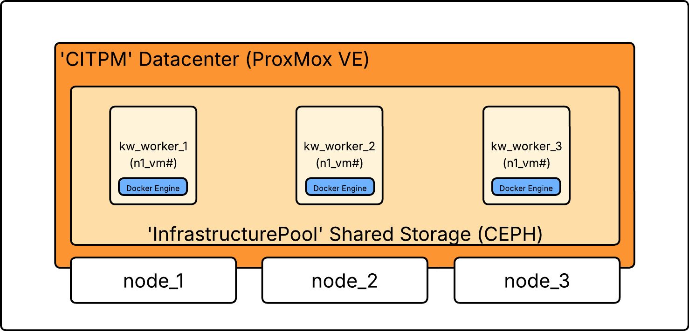
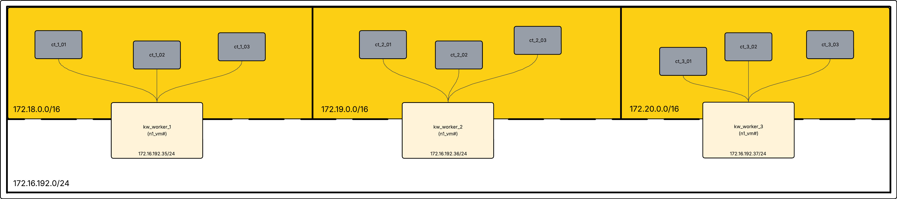

# citclab-docker-k8s-demo-2026

## Overview:
This repo documents the setup of a locally hosted wikipedia server for use within a private school lab network. This project has two main goals. The first goal is to gain hands on experience with the Docker and Kubernetes platforms while also further developing my familiarity with container environments. The second aim for this peoject is to use the demo as an opportunity to more accurately understand the practical implications of using a docker-k8s stack for service delivery over a private school network, and to research the practicality and feasbility of migrating an existing SIEM platform **(Wazuh)** from a **fully virtualized (VM)** implementation to **containerized (CT)** implementation.

More information regaurding the Wazuh migration can be foud [here]. | **(Need to update after Wazuh repo is created)**

## Existing Infrastructure:
The underlying physical hardware supporting the citclab.edu virtualization infrastructure consists of three Dell PowerEdge blade servers: node1_R430, node2_R720, and node3_R620 - each model number corresponds to its respective node. These three nodes are used to compose a High Avilability (HA) cluster in **ProxMoxVE 9.1.4**, and come together to serve as the networks reliable and available hypervisor. This cluster uses **CEPH 19.2.3** to provide synchronized and distributed shared storage across all three nodes. The shared storage pool is called **InfrastructurePool** and has a total capacity of **4TB**. This pool serves the networks essential systems by providing immediate VM replication in the event of node failure. **Ubuntu Server 24.04.3** is used as the default distribution for all linux-based machines that are being fully virtualized. If a service is tagged with **(VM)**, then it should be assumed that the underlying system supporting the service is Ubuntu. Additionally, If a service or system is tagged with **(CT)**, then it should be assumed that is uses Alpine as its base image.

Docker is used in conjuction with containerd & runc **(VM)** to serve as the container runtime. Container orchestration is managed by a fully distributed Kubernetes **(VM)** stack (full k8s; non-k3s). Alpine Linux is used as the base linux distribution for all container images deployed throughout this project. Nginx **(CT)** is used as the ingress controller and load balancer to manage traffic routed to the application-containers (**Note:** This service will likely be replaced with Traefik in the future). Kiwix **(CT)** is used as the offline web browser that processes querries. All instances of Kiwix reference a central wikipedia data-dump file (wikipedia_en_all_maxi_2025-08.zim) that is hosted locally on a NAS and is exported as an NFS share (172.16.192.9:\wikipedia-data-dumps). 

Upon initial launch, services will be made avilable at **wiki.citclab.edu**.

## Architecture & Dependance Hierarchy:
This is a generalized dependance hierarchy of how the services and systems are layered. It should be noted that this hierarchy does not accurately demonstrate the projects networking dynamics.
* Hardware: Physical infrastructure (networking, 3x servers, central storage)
* Logical Layer 1: ProxMoxVE 9.1.4, CEPH 19.2.3
* Logical Layer 2: Ubuntu Server 24.04.3
* Logical Layer 3: Docker Engine 29.1.5
* Logical Layer 4 (service layer): Kiwix, Nginx
* Logical Layer 5 (orchestration layer): Kubernetes 1.35

## Networking:

# Installation & Deployment

## 1. Provisioning:
**To Do:** Configurations and resource allocations for the worker node VMs.
* Naming
* Memory Allocation
* CPU Allocation
* Storage Pool & Allocation
* Network Adapter & Relevant Topology

## 2. Platform Preparation:
### 2.1 Worker Prep:
**To Do:** Preparing the worker nodes for use. This involves:
* Docker Engine Install
* Kubernetes Configuration
* Mounting NFS Export
* Image Creation / Pull
* Internal Networking

### 2.2 Nginx Prep:
* Network Configurations
* Master Config
* ???
**Note:** This will be dependant upon how nginx is implemented and is pending further research.

## 3. Kubernetes Deployment & Configuration:
* ???

## 4. DNS Configuration:
* ???

## 5. Certificate Authority Configuration:
* ???
    
    NFS --- Storage[(TrueNAS / Storage)]
